# Sistema web academico 

- Universidad: UPDS
- Carrera: ING.  SISTEMAS
- Materia: Programacion IV
- Docente: Ph. D. Luigi Antequera Tamari
- Titulo: Sistema web academico con enfoque en calidad y arquitectura
- Grupo: 4
- Integrantes:
  - Integrante 1: Cristian	
  - Integrante 2: Diego
  - Integrante 3: Jonathan
  - Integrante 4: Michael
- Fecha:

## Resumen del avance
- Estructura base del backend creada.
- Plan de trabajo con roles y kanban definido.
- Prerequisitos tecnicos y versionado definidos.
- Esquema de base de datos propuesto y validado contra RF01-RF12.

## Requisitos funcionales 
- RF01 Registro de usuarios con rol.
- RF02 Inicio de sesion y control por rol.
- RF03 Gestion de perfiles y cambio de contrasena.
- RF04 Gestion de cursos.
- RF05 Inscripcion a cursos sin duplicidad.
- RF06 Visualizacion de cursos por usuario.
- RF07 Registro y visualizacion de calificaciones.
- RF08 Dashboard por rol.
- RF09 Gestion de usuarios por administrador.
- RF10 Notificaciones.
- RF11 Cierre de sesion.
- RF12 Reportes PDF y Excel por rol.

Nota importante: el alumno no registra notas, solo consulta sus calificaciones.
Nota: se contempla roles multiples por usuario y seleccion de rol activo en login.

## Tecnologias usadas
- Backend: Node.js + Express + TypeScript.
- Frontend: Vue 3 + TypeScript (Vite).
- Base de datos: PostgreSQL 16.

## Prerequisitos oficiales
- Windows 10/11
- Node.js LTS 20.x
- Git 2.45+
- PostgreSQL 16.x
- Visual Studio Code
- Chrome o Edge

## Clonado del repositorio
```bash
git clone https://github.com/elunboundfiremail/WebAppAcademico
cd WebAppAcademico
```

## Arquitectura
Arquitectura limpia con capas:
- domain: entidades y reglas
- application: casos de uso
- infrastructure: base de datos, servicios externos
- interfaces: controladores y rutas

## Base de datos 
### Tablas principales
- usuarios: id, primer_nombre, segundo_nombre, apellido_paterno, apellido_materno, correo, ci, password_hash, telefono, activo, fecha_baja, creado_en
- roles: id, nombre
- usuarios_roles: usuario_id, rol_id
- carreras: id, nombre, descripcion, activo, fecha_baja
- materias: id, carrera_id, codigo, nombre, descripcion, activo, fecha_baja
- cursos: id, materia_id, docente_id, periodo, gestion, cupo, activo, fecha_baja
- curso_horarios: id, curso_id, dia_semana, hora_inicio, hora_fin, aula
- inscripciones: id, estudiante_id, curso_id, fecha_inscripcion, estado, activo
- calificaciones: id, inscripcion_id, nota, fecha_registro, observacion
- notificaciones: id, usuario_id, titulo, mensaje, leido, creado_en

### Indices obligatorios
- usuarios(correo) unique
- usuarios(ci) unique
- roles(nombre) unique
- usuarios_roles(usuario_id, rol_id) unique
- materias(codigo) unique
- inscripciones(estudiante_id, curso_id) unique
- calificaciones(inscripcion_id) unique
- cursos(materia_id, docente_id, periodo, gestion)
- curso_horarios(curso_id, dia_semana, hora_inicio)

### Triggers y procedimientos
- Trigger para validar solapamiento de horarios por estudiante y docente.
- Trigger para validar cupo antes de inscribir.
- Procedimientos para reportes RF12.

Nota de diseno: se usa roles multiples para un mismo usuario. Esto evita duplicar cuentas
cuando una persona es docente y estudiante a la vez. El ciclo usuarios -> cursos -> inscripciones
es funcional y no genera redundancia porque solo hay claves foraneas.

## Diagramas
### Diagrama de casos de uso (general)
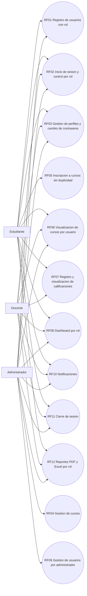

### Diagrama ER
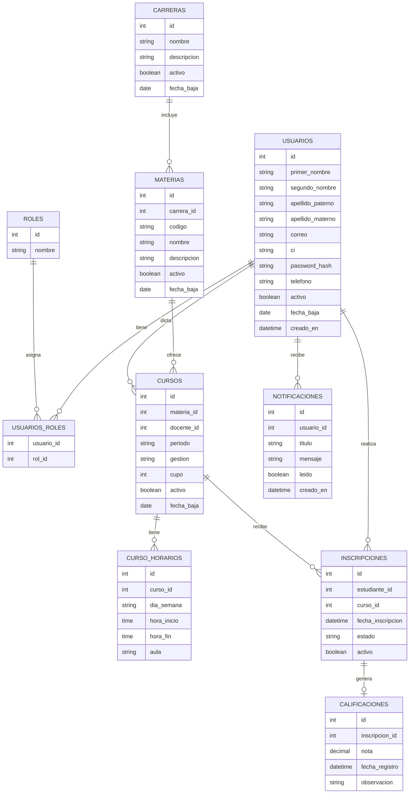

### Diagrama EER (usuarios y roles)
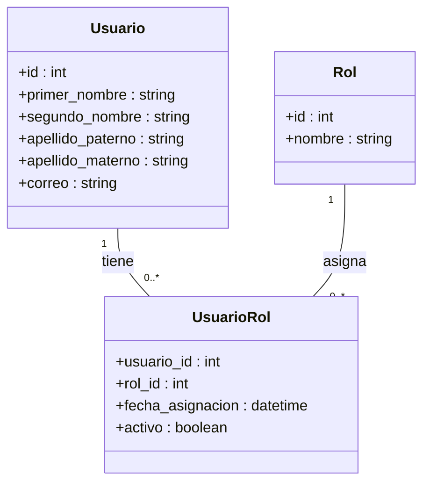

### Diagramas de secuencia
#### RF01 Registro de usuarios
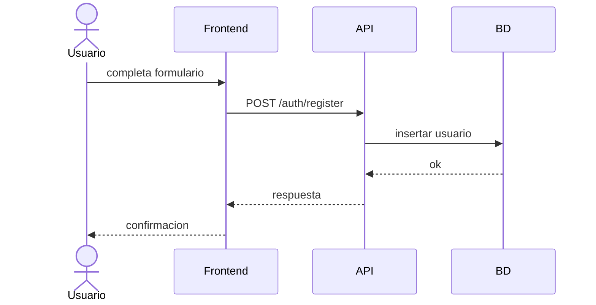

#### RF02 Inicio de sesion
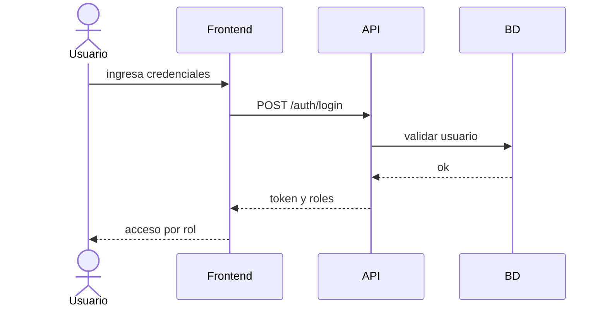

#### RF03 Gestion de perfiles
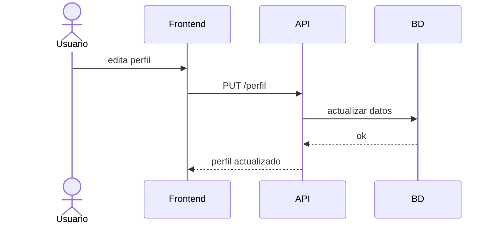

#### RF04 Gestion de cursos


#### RF05 Inscripcion a cursos
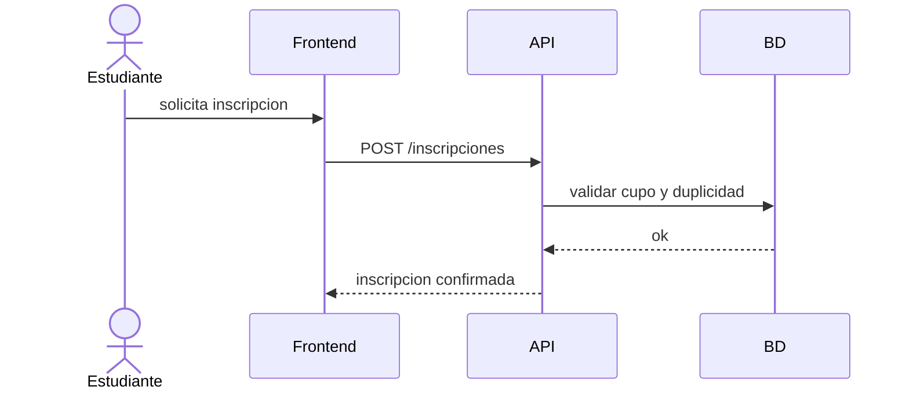

#### RF06 Visualizacion de cursos
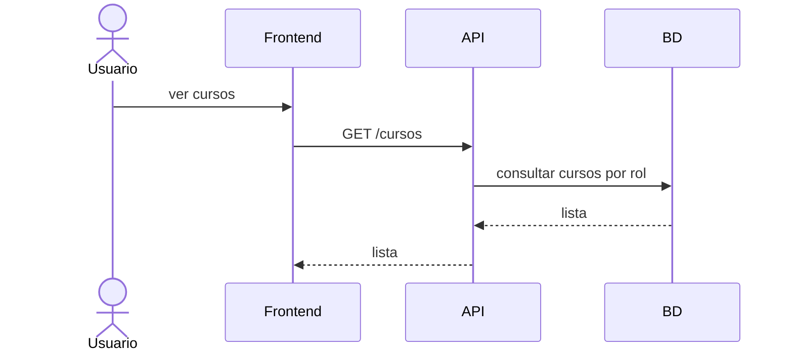

#### RF07 Registro de calificaciones
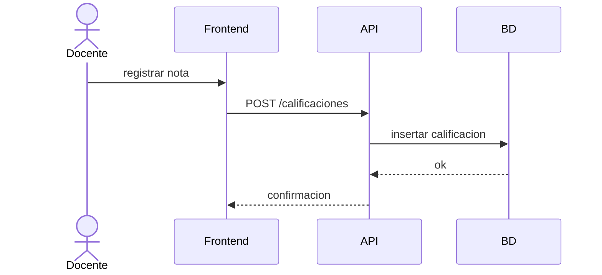

#### RF08 Dashboard
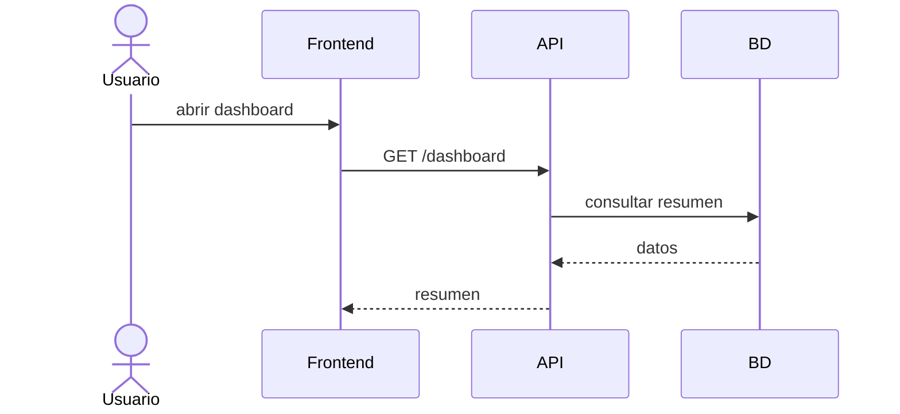

#### RF09 Gestion de usuarios
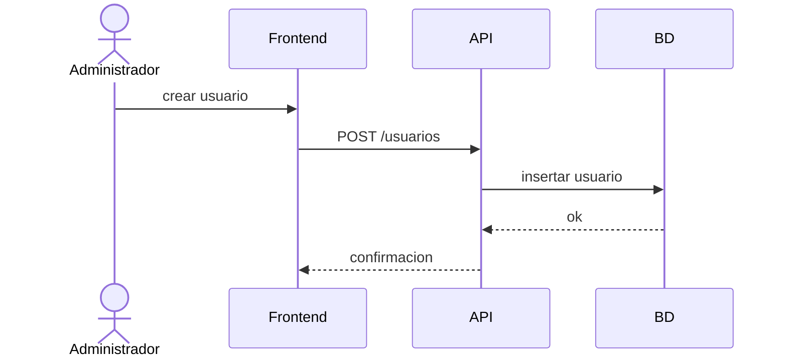

#### RF10 Notificaciones
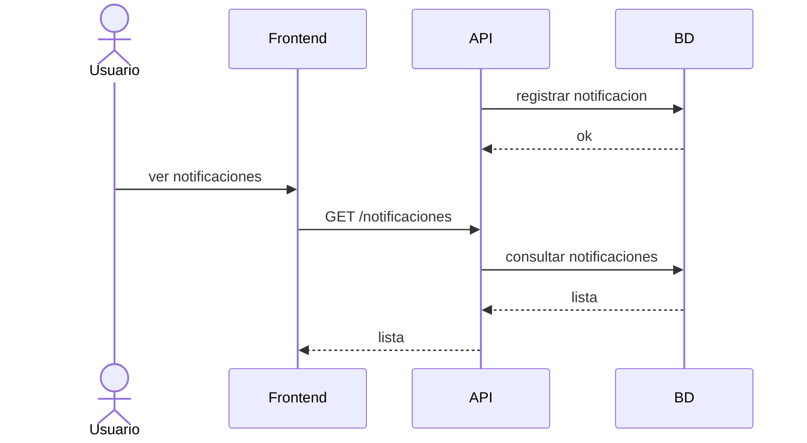

#### RF11 Cierre de sesion
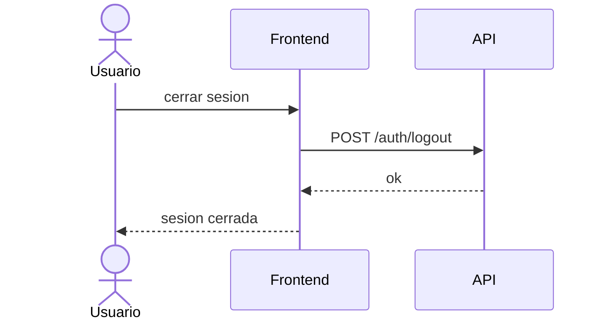

## Politica de contribucion
- Commits y pushes los realiza cada integrante con su usuario.
- No usar "Co-authored-by: Copilot" en los commits.
- La lista de contributors la genera GitHub segun los commits en el repo.
